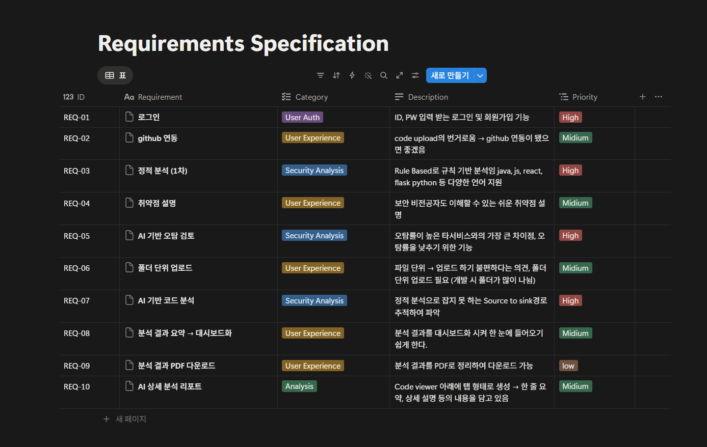

# 1주차

### 1. Objective

- 1인 개발 프로젝트의 기초가 될 **요구사항 분석(Requirements Analysis)** 및 **기능명세서(Functional Specification)** 작성 완료.

### 2. Work Summary

- **User Flow 설계:** 로그인부터 대시보드 이동까지의 논리적 흐름 구성.
- **Data Specification 정의:** ID/PW(String), 인증 방식(Session/JWT) 등 데이터 규격 확립.
- **Security Requirements 명세:** HTTPS 통신, 비밀번호 해시화(Hashing) 등 보안 요소 반영.
- **Architecture Planning:** 무작정 코딩하기보다 서비스의 전체적인 '지도'를 그리는 설계 단계에 집중.

### 3. Issue & Trouble Shooting

- **Issue (고민):** 보안 강화(계정 즉시 잠금)와 사용자 편의성(비밀번호 망각) 사이의 논리적 충돌 발생.
- **Solution (해결):** * 메이저 서비스 보안 정책 리서치 수행.
    - **타협점 도출:** '5회 오류 시 계정 잠금' + '무차별 대입 공격 방지를 위한 CAPTCHA 도입'.
    - **보안 원칙 수립:** 보안 사고 예방을 위해 DB 내 비밀번호 평문 저장 금지 및 해시화 저장 규칙 명문화.

### 4. Review

- 1인 개발일수록 설계도가 완벽해야 코딩 단계의 혼란을 막을 수 있음을 깨달음.
- 글로 예외 상황을 정리하며 머릿속 설계의 빈틈(Edge Cases)을 발견하고 보완하는 과정이 매우 유익했음.
- 단순 기능 구현을 넘어 보안 설계의 중요성과 책임감을 배우는 계기가 됨.

### 5. Next Week's Goal

- **Remaining Specs:** 미처 마무리하지 못한 나머지 기능들의 상세 명세서 작성 완료.
- **AI Research:** 프로젝트 핵심인 AI 모델링 구현을 위한 기초 이론 및 구조 학습.
- **Base Modeling:** 학습한 내용을 바탕으로 AI 모델의 기초 설계 시작.

