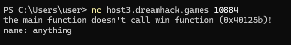

# ( System | baby-bof ) Writeup

### **문제 설명**

---

Simple pwnable 101 challenge

Q. What is Return Address?

Q. Explain that why BOF is dangerous.

[문제 소스 코드](baby-bof.c)

문제 소스 코드

# Writeup

---

## **Source Code Reading**

- **1. 컴파일 옵션 및 환경**
    
    ```c
    // gcc -o baby-bof baby-bof.c -fno-stack-protector -no-pie
    ```
    
    - `fno-stack-protector` : Canary X →스택 버퍼를 넘치게 써도 프로그램이 강제 종료 X
    - `no-pie`: PIE(위치 독립 실행) X → 프로그램이 실행될 때마다 함수들의 메모리 주소가 바뀌지 않고 고정
- **2. `win( )` 함수**
    
    ```c
    void win () {
      // ... (생략)
      fd = open ("./flag", O_RDONLY);
      read(fd, flag, 0x60);
      puts(flag);
      exit(0);
    }
    ```
    
    - 역할 : 플래그 파일(`flag`)을 읽어서 출력해 주는 함수
    
    ⇒  `main` 함수가 종료될 때 원래의 위치가 아닌 이 `win` 함수를 실행하게 프로그램의 흐름(EIP/RIP)을 조작
    
- **3. `main( )` 함수**
    
    **A. 변수 선언 및 주소 유출**
    
    ```c
    char name[16];
    // ...
    printf ("the main function doesn't call win function (0x%lx)!\n", win);
    ```
    
    - `name`: 스택에 16byte 크기의 버퍼가 할당
    - `printf`:  `win` 함수의 메모리 주소 출력
    
    **B. 첫 번째 입력 및 스택 확인**
    
    ```c
    printf ("name: ");
    scanf ("%15s", name);
    // ... 
    for (idx = 0; idx < 0x10; idx++) {
      printf ("|  %lx\t|  %16lx\t|\n", name + idx *8, *(long*)(name + idx*8));
    }
    ```
    
    - `scanf("%15s", name)` : 15글자만 입력 받음 → bof 발생 X
    - `for` 루프 : 스택(`name` 변수 위치부터)의 내용을 8바이트(long) 단위로 출력
    == 스택 구조 시각화
    
    **C. 취약점 발생 지점**
    
    ```c
    printf ("hex value: ");
    scanf ("%lx%c", &value); // 덮어쓸 값 입력 (win 함수의 주소)
    
    printf ("integer count: ");
    scanf ("%d%c", &count);  // 몇 번 덮어쓸지 횟수 입력
    
    for (idx = 0; idx < count; idx++) {
      *(long*)(name+idx*8) = value;
    }
    ```
    
    - `value` : 덮어씌울 데이터를 입력 받음
    - `count` : 루프를 몇 번 돌 지 입력 받음
    - `for` 루프 :
        - `name`은 `char` 배열이지만, `(long*)`로 캐스팅하여 8byte 단위로 접근합니다.
        - `idx`가 증가함에 따라 `name` 버퍼(16byte)를 넘어 SFP(Saved Frame Pointer)와 RET(Return Address) 영역까지 침범하여 `value` 값을 씀

## Attack Scenario



프로그램 실행 시 출력되는 첫 화면

- `win` 함수의 주소 = `0x40125b` 인 것 확인
- name 입력창이 뜨면 1~15자리 글자 입력 (아무거나 상관 X)


name 입력 후 출력되는 stack 구조

함수가 호출될 때 스택 메모리는 항상 정해진 순서대로 쌓임

** 지역 변수 → SEP → RET : 주소 낮은 순

| 순서 (index) | 내용 | 크기 |
| --- | --- | --- |
| 0 | name | 8byte |
| 1 | name | 8byte |
| 2 | SEP | 8byte |
| 3 | RET | 8byte |


value 및 count 입력 후 출력 화면