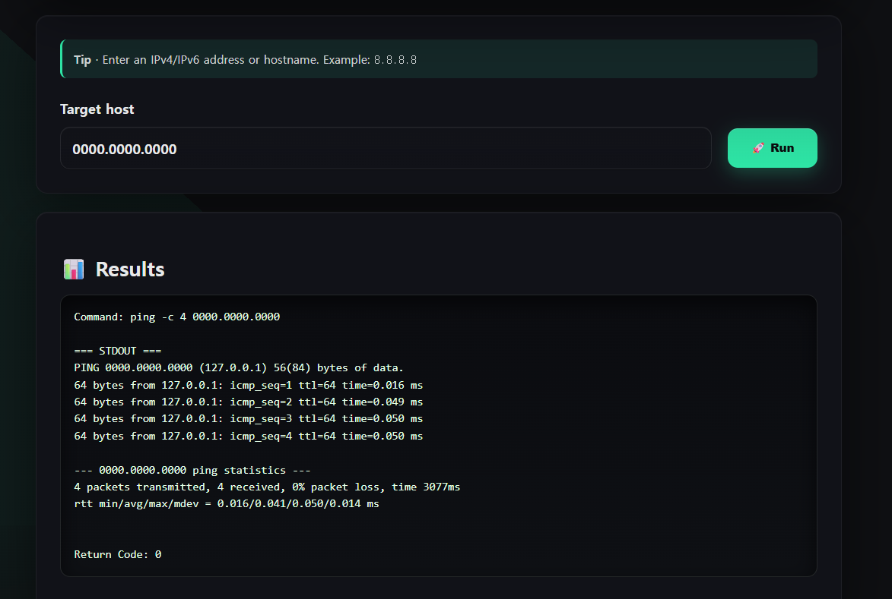

# ( Web | Another Ping )

### 문제 설명

What? Another, yet boring ping utility?

[문제 소스 코드](app.py)

문제 소스 코드

# Writeup

---

## **Source Code Reading**

- **1. 초기 설정 및 전역 데이터**
    
    ```python
    app = Flask(__name__)
    app.secret_key = os.urandom(32)
    
    FILTERED_CHARS = [' ', ';', '|', '&', '>', '<', '(', ')', '[', ']', '{', '}', '\n', '\r']
    ```
    
    - 비밀 키 설정: `os.urandom(32)`을 사용해 애플리케이션의 세션을 보호하기 위한 32바이트 무작위 키를 생성
    - 필터링 목록 정의: 사용자 입력 값에서 걸러낼 공백 및 특정 특수 문자들의 목록을 `FILTERED_CHARS` 배열에 미리 정의
- **2. 입력값 검증 함수 ( is_valid_ip, filter_input )**
    
    ```python
    def is_valid_ip(ip):
        ip_pattern = r'^(\d{1,3}\.){3}\d{1,3}$'
        return bool(re.match(ip_pattern, ip))
    
    def filter_input(user_input):
        for char in FILTERED_CHARS:
            if char in user_input:
                return False, f"Invalid character detected: {char}"
        return True, "OK"
    ```
    
    - IP 형식 검사: 정규표현식을 사용하여 입력 받은 문자열이 일반적인 IPv4 주소 형태에 맞는지 판별하고 참/거짓(True/False)을 반환
    - 특수문자 필터링: 사용자의 입력값 문자열을 순회하며 `FILTERED_CHARS`에 정의된 문자가 하나라도 포함되어 있는지 검사하고, 발견될 경우 `False`와 에러 메시지를 반환
- **3. 메인 페이지 (`/`)**
    
    ```python
    @app.route('/')
    def index():
        return render_template('index.html')
    ```
    
    - 기본 화면 출력: 사용자가 웹사이트의 최상위 기본 경로(`/`)로 접속했을 때, `index.html` 파일을 화면에 렌더링하여 보여줌
- **4. Ping 테스트 실행 API (`/ping`)**
    
    ```python
    @app.route('/ping', methods=['POST'])
    def ping():
        ip = request.form.get('ip', '').strip()
        
        if not ip:
            return jsonify({'error': 'IP address is required'}), 400
        
        is_valid, message = filter_input(ip)
        if not is_valid:
            return jsonify({'error': message}), 400
        
        try:
            cmd = f"ping -c 4 {ip}"
            result = subprocess.run(cmd, shell=True, capture_output=True, text=True, timeout=10)
            
            return jsonify({
                'command': cmd,
                'stdout': result.stdout,
                'stderr': result.stderr,
                'returncode': result.returncode
            })
        
        except subprocess.TimeoutExpired:
            return jsonify({'error': 'Command timed out'}), 500
        except Exception as e:
            return jsonify({'error': str(e)}), 500
    ```
    
    - 입력값 수신: POST 요청의 폼 데이터에서 `ip` 값을 가져오고, 값이 비어있다면 400 에러 코드 반환
    - 입력값 검증: `filter_input(ip)` 함수를 호출하여 입력값에 필터링 대상 문자가 섞여 있는지 확인하고, 포함되어 있다면 400 에러 반환
    - 명령어 실행: 검증을 통과하면 `subprocess.run`을 사용하여 시스템 셸에서 `ping -c 4 [입력받은 ip]` 명령어를 실행하며, 최대 10초간 대기
    - 결과 반환: 정상적으로 실행되면 명령어, 표준 출력(`stdout`), 표준 에러(`stderr`), 반환 코드(`returncode`)를 모아 JSON 데이터 형식으로 사용자에게 전달
    - 예외 처리: `try-except` 구문을 통해 10초가 넘어가면 타임아웃 500 에러, 그 외의 예기치 못한 시스템 오류 발생 시에는 해당 에러 메시지와 함께 500 에러 반환
- **5. 서버 실행**
    
    ```python
    if __name__ == '__main__':
        app.run(host='0.0.0.0', port=8000, debug=False)
    ```
    
    - 앱 구동: 스크립트가 실행될 때, 외부의 모든 IP(`0.0.0.0`)에서 접근할 수 있도록 포트 8000번을 열어 서버를 구동

## Attack Scenario

소스 코드에 입력값 검증 함수 존재

→ but, `is_valid_ip` 는 실행 X, `filter_input` 만 `/ping` 에서 실행



- `is_valid_ip` 에 걸리게끔 입력 → but, `is_valid_ip` 실행 X


- 블랙리스트로 필터링 ⇒ 분명 빈틈이 있을 것
- google 서치 해 보니 백터로 치환 가능
→ 약간 수학 문제에서 괄호 같은 느낌
→ 백터 내 명령어 실행 결과로 치환
- 오류 메시지를 통해 flag 출력

```bash
ping -c 4 0.0.0.0`cat	./flag.txt`
```

- `' '` 는 필터링에 걸림 ⇒ `/t` (tab)으로 대체