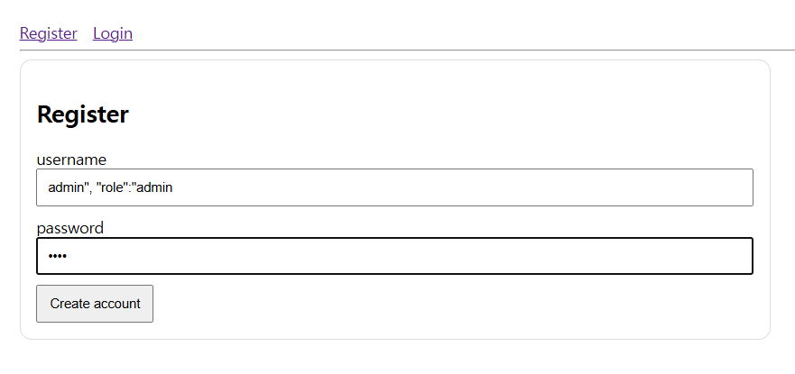

# ( Web | {”role”: ”admin”} )

### 문제 설명

Can you gain admin access?

[문제 소스 코드](app.py)

문제 소스 코드

# Writeup

---

## **Source Code Reading**

- **1. 초기 설정 및 전역 데이터**
    - `USERS = {}`, `UID = {}`: 데이터베이스 대신 사용하는 메모리 저장소, `USERS`는 유저의 전체 정보를, `UID`는 이름으로 ID를 찾기 위해 사용
    - `pw_hash(pw)`: 비밀번호를 `SHA-256` 방식으로 암호화, 보안을 위해 평문 대신 해시값을 저장
    - 기본 계정: `admin`(관리자)과 `guest`(일반 유저) 계정이 미리 생성
- **2. 메인 페이지 ( `/` )**
    
    ```python
    @app.route("/", methods=["GET"])
    def index():
        user = current_user()
        if not user:
            return redirect(url_for("login"))
        return render_template("index.html", ...)
    ```
    
    - 로그인 확인: `current_user()`를 호출해 세션에 유저 정보가 있는지 확인
    - 로그인 안 됨: 로그인 페이지(`/login`)로 강제 이동(Redirect)
    - 로그인 됨: 유저의 이름과 역할(`role`)을 `index.html`에 전달하여 화면에 출력
- **3. 회원 가입 페이지 ( `/register` )**
    
    ```python
    @app.route("/register", methods=["GET", "POST"])
    def register():
        # ... 중략 ...
        raw_user = (
            f'{{"role":"user",'
            f'"username":"{username}",'
            f'"pw":"{pw}",'
            f'"uid":"{uid}"}}'
        )
        user = json.loads(raw_user)
        # ... 후략 ...
    ```
    
    - **사용자 입력**: `username`과 `password`를 받습니다.
    - **JSON 생성 방식**: 딕셔너리를 만드는 대신, **f-string(문자열 더하기)**으로 직접 JSON 모양의 문자열을 만듭니다.
    - **위험 요소**: 사용자가 `username`에 `"`나 `,` 같은 문자를 넣으면 JSON의 구조를 바꿀 수 있습니다. (예: `admin", "role":"admin`)
- **4. 로그인 페이지 ( `/login` )**
    
    ```python
    @app.route("/login", methods=["GET", "POST"])
    def login():
        # ... 중략 ...
        uid = UID.get(username)
        user = USERS.get(uid)
        if not user or user.get("pw") != pw_hash(password):
            return render_template("login.html", error="로그인 실패")
    
        session["uid"] = uid # 세션에 저장
        return redirect(url_for("index"))
    ```
    
    - 유저 조회: 입력한 `username`으로 `UID`와 `USERS`를 차례로 뒤져서 유저 정보를 가져옴
    - 비밀번호 검증: 입력한 비밀번호의 해시값과 저장된 해시값이 같은지 비교
    - 세션 부여: 일치하면 브라우저 쿠키(세션)에 `uid`를 저장하여 로그인 상태를 유지
- **5. 내 정보 & 플래그 확인 ( `/me`, `/flag` )**
    
    ```python
    @app.route("/flag", methods=["GET"])
    def flag():
        user = current_user()
        if user.get("role") == "admin":
            return jsonify(flag=FLAG)
        return jsonify(error="forbidden"), 403
    ```
    
    - `/me`: 로그인한 유저의 정보를 JSON 데이터로 출력 (비밀번호 제외)
    - `/flag`: 현재 로그인한 유저의 `role` 값이 문자열 admin인 경우에만 실제 `FLAG`를 반환, 일반 유저는 403 에러가 발생

## Attack Scenario



: Register page

- 입력 받는 값에 대한 필터링 존재 X ⇒ `“` , `,` 등 사용으로 JSON 구조 변경 가능
- 중복된 key 입력 시 대부분의 파서는 마지막 값으로 덮어씀


- but, 이미 admin id의 계정 존재


- 입력 시 admin 권한의 계정 생성 → 해당 계정으로 login


: login 후 main page

- role : admin 확인 → flag page 접속 가능
- flag 획득

